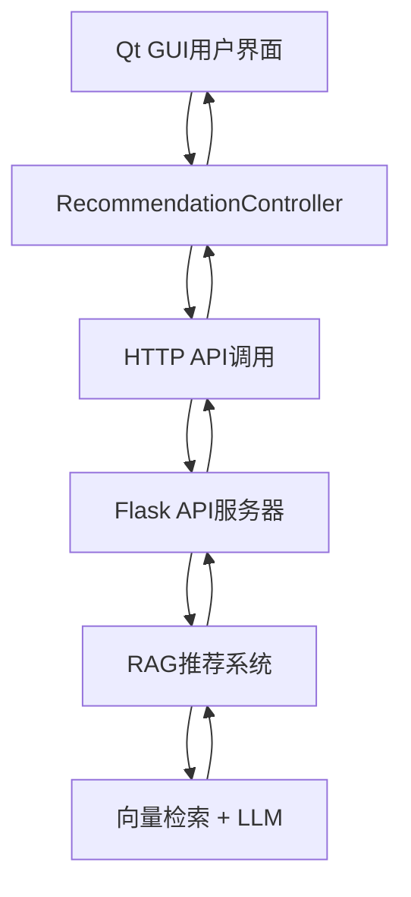

# 🤖 AI导购助手集成指南

## 📋 系统架构



## 🚀 快速启动

### 1. 安装Python依赖

```bash
cd Ai_model
pip install -r requirements.txt
```

### 2. 准备AI模型

如果还没有训练微调模型：

```bash
cd Ai_model
python train_retriever.py
```

### 3. 启动AI服务器

```bash
cd Ai_model
python start_ai_server.py
```

或者直接：

```bash
cd Ai_model  
python api_server.py
```

### 4. 启动Qt应用

```bash
cd build
./SmartPOS
```

## 🔧 配置选项

### AI模型切换

在代码中可以切换使用AI模型或占位符逻辑：

```cpp
// 在MainWindow构造函数中
m_recommendationController->setUseAiModel(true);  // 使用AI模型
m_recommendationController->setUseAiModel(false); // 使用占位符
```

### 服务器地址配置

```cpp
// 修改AI服务器地址
m_recommendationController->setAiServerUrl("http://localhost:5000");
```

## 🎯 功能特性

### 1. 购物车智能推荐

- **触发时机**: 用户添加商品到购物车时自动触发
- **工作原理**: 分析购物车中现有商品，使用AI生成相关推荐
- **推荐策略**: 基于商品类别、价格区间、互补性等多维度分析

```cpp
// 购物车更新时自动调用
void MainWindow::onCartUpdated() {
    // 提取购物车商品信息
    // 调用AI推荐接口
    m_recommendationController->generateRecommendationForCart(cartProductIds);
}
```

### 2. 自然语言查询推荐

- **触发时机**: 用户点击"AI导购"按钮
- **工作原理**: 理解用户自然语言需求，智能匹配商品
- **支持查询**: 
  - "我想买一些健康的零食"
  - "需要户外运动装备"
  - "给孩子买学习用品"

```cpp
// AI导购按钮点击事件
void MainWindow::onAiSearchClicked() {
    QString userQuery = ui->searchLineEdit->text();
    m_recommendationController->generateRecommendationForQuery(userQuery);
}
```

### 3. 推荐结果展示

- **UI界面**: 专业的推荐对话框
- **交互方式**: 
  - 单选推荐商品
  - 全部添加到购物车
  - 查看商品详情
- **用户体验**: 流畅的动画和反馈

## 🔍 调试功能

### 完整的日志跟踪

系统提供详细的调试日志，覆盖整个推荐流程：

1. **购物车分析**: 记录购物车商品提取过程
2. **AI请求**: 记录发送给AI服务器的请求数据
3. **模型处理**: 记录AI模型的处理过程和结果
4. **结果解析**: 记录推荐结果的解析和转换
5. **UI更新**: 记录用户界面的更新过程

### 错误处理

- **网络错误**: 自动重试和错误提示
- **AI服务器错误**: 优雅降级到占位符逻辑
- **数据解析错误**: 详细的错误信息和恢复机制

## 📊 性能优化

### 1. 异步处理

- 所有AI请求都是异步的，不会阻塞UI
- 使用Qt信号槽机制确保线程安全
- 网络请求超时设置（30秒）

### 2. 缓存策略

- AI服务器端缓存商品信息
- Qt端缓存最近的推荐结果
- 减少重复的网络请求

### 3. 资源管理

- 自动内存管理
- 网络连接池优化
- 合理的超时设置

## 🛠️ 开发和扩展

### 添加新的推荐策略

1. **服务器端**: 在`api_server.py`中添加新的API端点
2. **客户端**: 在`RecommendationController`中添加新的方法
3. **UI**: 根据需要更新用户界面

### 集成其他AI模型

```python
# 在api_server.py中替换AI模型
def initialize_recommender():
    # 使用你的自定义AI模型
    recommender = YourCustomRecommender()
    return recommender
```

### 自定义商品数据格式

```python
# 在parseAiResponse中处理自定义数据格式
def parse_ai_response(ai_response):
    # 解析你的自定义商品格式
    recommendations = []
    # ... 你的解析逻辑
    return recommendations
```

## 🎉 使用示例

### 场景1: 购买水果后的推荐

```
用户操作: 添加"苹果"到购物车
AI分析: "用户购买了新鲜水果"
推荐结果: 香蕉、橙汁、酸奶
推荐理由: 健康饮食的互补搭配
```

### 场景2: 自然语言查询

```
用户查询: "我想买一些健康的零食"
AI理解: 健康食品偏好
推荐结果: 坚果、酸奶、水果干
推荐理由: 营养价值高、低糖低脂
```

### 场景3: 户外运动需求

```
用户查询: "准备去露营，需要什么装备？"
AI分析: 户外露营场景需求
推荐结果: 帐篷、睡袋、户外炊具
推荐理由: 露营必需品组合推荐
```

## 🚨 故障排除

### 常见问题

1. **AI服务器无法启动**
   - 检查Python依赖是否安装完整
   - 确认微调模型文件存在
   - 检查端口5000是否被占用

2. **推荐结果为空**
   - 检查AI服务器是否正常运行
   - 验证网络连接
   - 查看服务器日志确认处理过程

3. **推荐质量不佳**
   - 重新训练微调模型
   - 调整推荐算法参数
   - 增加训练数据量

### 日志查看

- **Qt应用日志**: 在终端查看详细的调试输出
- **AI服务器日志**: 查看Flask服务器的控制台输出
- **模型处理日志**: 在Python代码中添加更多调试信息

## 📈 后续优化方向

1. **模型性能**: 使用更先进的LLM模型
2. **推荐精度**: 基于用户行为数据持续优化
3. **实时性**: 减少推荐响应时间
4. **个性化**: 引入用户画像和个性化推荐
5. **多模态**: 支持图片、语音等多种输入方式

---

**恭喜！** 🎊 你已经成功集成了完整的AI导购助手系统！ 